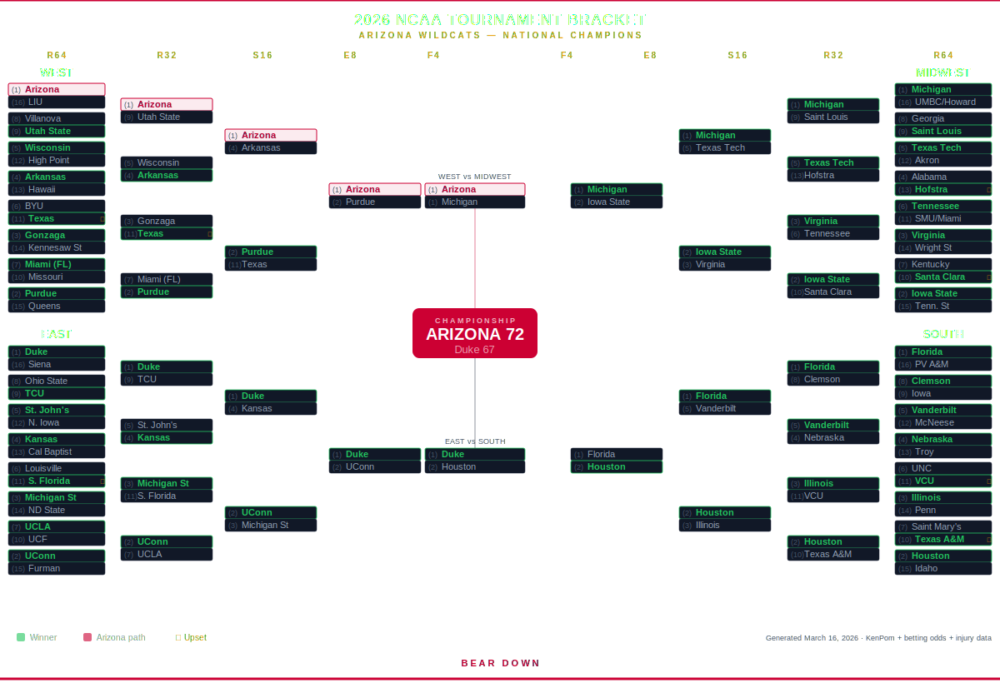

# 🏀 Bear Down Bracket 2026

> **Arizona Wildcats — 2026 NCAA Tournament National Champions (predicted)**

## 🔗 [View the Full Interactive Bracket →](https://bear-down-bracket-2026.netlify.app)

---

## Overview

A complete, data-driven 2026 March Madness bracket with the **Arizona Wildcats cutting down the nets in Indianapolis**. Every pick is backed by real stats, injury reports, KenPom ratings, and betting odds.

## Arizona's Case

| Stat | Value | Rank |
|------|-------|------|
| Record | 32-2 (16-2 Big 12) | — |
| AP Poll | #2 | — |
| Adj. Offensive Efficiency | 120.3 | 17th |
| Adj. Defensive Efficiency | 96.1 | 10th |
| SRS | 29.93 | 3rd |
| Points Per Game | 86.1 | 14th |
| Title Odds | +400 | 3rd favorite |
| Current Streak | 9 wins | — |

**Key Players:** Brayden Burries (16 PPG), Koa Peat (13.8 PPG, 54.8% FG), Jaden Bradley (Big 12 POY), Motiejus Krivas

## Final Four

| Semifinal | Matchup | Winner |
|-----------|---------|--------|
| East vs South | (1) Duke vs (2) Houston | Duke |
| West vs Midwest | (1) Arizona vs (1) Michigan | **Arizona** |
| **Championship** | **Arizona vs Duke** | **Arizona 72-67** |

**MOP: Brayden Burries — 26 pts, 6 reb, 4 ast**

## Region Champions

| Region | Champion | Path |
|--------|----------|------|
| 🔴 West | **(1) Arizona** | LIU → Utah State → Arkansas → Purdue |
| 🔵 East | (1) Duke | Siena → TCU → Kansas → UConn |
| 🟡 Midwest | (1) Michigan | UMBC/Howard → Saint Louis → Texas Tech → Iowa State |
| 🟠 South | (2) Houston | Idaho → Texas A&M → Illinois → Florida |

## Key Upsets

- **(11) Texas over (6) BYU** — Richie Saunders torn ACL
- **(13) Hofstra over (4) Alabama** — 83.5 PPG allowed, Holloway arrested pre-tourney
- **(11) South Florida over (6) Louisville** — Mikel Brown Jr. injury, 6v11 hits every year since 2005
- **(10) Santa Clara over (7) Kentucky** — 7v10 upsets hit ~40% historically
- **(11) Texas over (3) Gonzaga** — Braden Huff out since January
- **(2) Houston over (1) Florida** — Elite 8 rematch of 2025 title game, Houston's D is #1

## Data Sources

Picks informed by:
- **KenPom** adjusted efficiency ratings & SRS
- **BetMGM / DraftKings** betting odds and lines
- **ESPN BPI** projections and win probabilities
- **Injury reports** (BYU, Gonzaga, Louisville, Alabama, Duke)
- **Historical upset patterns** (6v11, 7v10, conference tourney losers)

## Tech

Static single-page HTML/CSS — no build step, no dependencies. Just deploy and go.

---

**Bear Down! 🐻⬇️**
